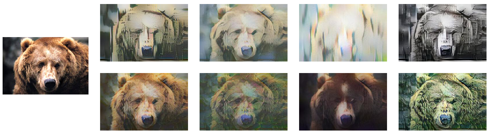
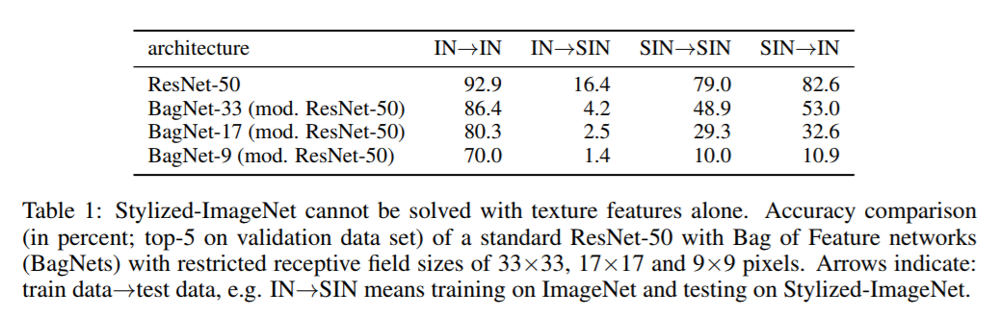
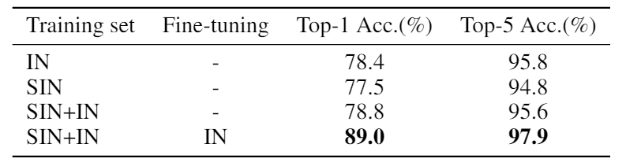
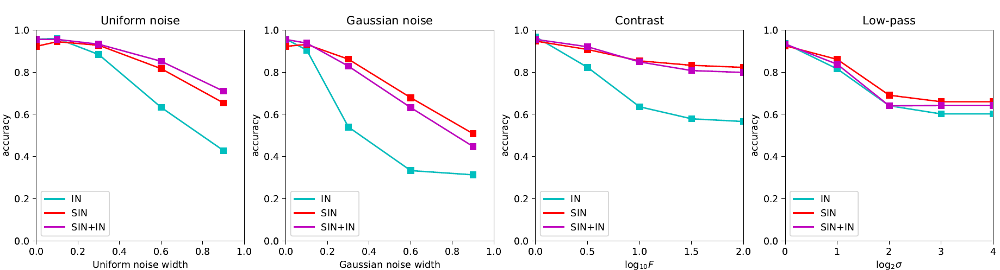

# Reproduce-texture-vs-shape

Paper: [ImageNet-trained CNNs are biased towards texture; increasing shape bias improves accuracy and robustness](https://openreview.net/forum?id=Bygh9j09KX)

Repo: [texture-vs-shape](https://github.com/rgeirhos/texture-vs-shape)

## Introduction
We reproduced an oral ICLR paper, named ``ImageNet-trained CNNs are biased towards texture; increasing shape bias improves accuracy and robustness''. We implemented the most important part in the original paper and briefly discussed experiments on a subset of the ImageNet dataset (only 16 classes). 
We found that ResNet-50 trained on Stylized ImageNet is more accurate and robust than the same network trained only on ImageNet. We also verified that shape-based representations are more robust than the texture representations.
All codes except the style transfer are written by the two authors.

## Dataset
A subset of ImageNet (only 16 classes), referred as IN-16, and stylized IN-16, referred as SIN-16, are used as raw input for training.
The figure below shows an example of stylized images.

In stylized images, original texture is replace by another random texture, only the shape is preserved.
Datasets can be downloaded from [imagenet-16](https://www.kaggle.com/davidddxu/imagenet16) 
and [stylizedimagenet-16](https://www.kaggle.com/davidddxu/stylizedimagenet16).

Code for style transfer using AdaIN can be found here ([stylize-datasets](https://github.com/Hvitgar/stylize-datasets)).

## Texture Bias
The author believes that ImageNet-trained CNNs are biased towards texture, since models trained on IN achieved a low accuracy on SIN. However, models trained on SIN tend to achieve similar or better performance on IN. 
The table below (taken from the original paper) shows detailed results.

## Results
### Accuracy
The table below shows the performance of a Res-50 network when trained on various datasets.
The model trained on SIN+IN dataset and fine-tuned using IN achieved a significantly better performance (both top-1 and top-5 accuracy) than other models.

### Robustness
The figure below shows the performance of Res-50 networks when evaluated on distorted images.
Models trained on SIN tend to be more robust than those trained on IN.

## Conclusion
Stylizing a whole dataset can be seen as a data augmentation method, which expands the dataset and helps capture shape representations. 
Deep CNNs trained on Stylized dataset tend to be more accurate and robust.
